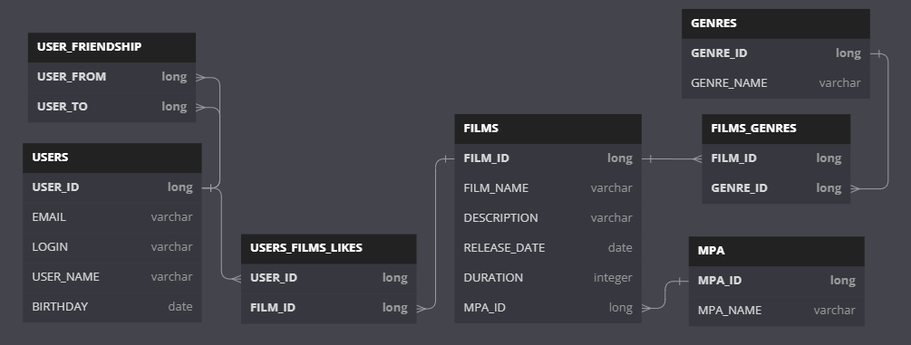

## Структура БД



---

## Описание БД

---

### users
Таблица со всеми пользователями<br>
<b>id</b> - ключевое поле, авто инкремент<br>
<b>email, login, name, birthday</b> - данные о пользователе

---

### users_friendship
Таблица с информацией о дружбе между пользователями<br>
<b>(user_from, user_to)</b> - составной ключ<br>
<b>user_from</b> - от кого направлен запрос на дружбу<br>
<b>user_to</b> - кому направлен запрос на дружбу

<b>Запрос в друзья от пользователя 1 к пользователю 2 (или принятие приглашения в друзья пользователем 1 от пользователя 2)</b>
```
INSERT INTO users_friendship (user_from, user_to)
VALUES (1, 2)
```

<b>Отклонить запрос в друзья от пользователя 1 к пользователю 2</b>
```
DELETE FROM users_friendship
WHERE user_from = 1 AND user_to = 2
```

<b>Разорвать дружбу между пользователем 1 и пользователем 2</b>
```
DELETE FROM users_friendship
WHERE user_from = 1 AND user_to = 2;
DELETE FROM users_friendship
WHERE user_from = 2 AND user_to = 1;
```

<b>Получить ожидающие подтверждения запросы в друзья к пользователю 1</b>
```
SELECT user_to
FROM users_friendship
WHERE user_from = 1 AND user_to NOT IN (
    SELECT user_from
    FROM users_friendship
    WHERE user_to = 1
);
```

<b>Получить список подтвержденных друзей пользователя 1</b>
```
SELECT user_to
FROM users_friendship
WHERE user_from = 1 AND user_to IN (
    SELECT user_from
    FROM users_friendship
    WHERE user_to = 1
);
```

---

### films
Таблица со всеми фильмами<br>
<b>id</b> - ключевое поле, авто инкремент<br>
<b>name, description, release_date, duration</b> - данные о фильме<br>
<b>mpa_id</b> - ссылка на MPA фильма

---

### films_genres
Таблица для взаимосвязи фильма и его жанров<br>
<b>(film_id, genre_id)</b> - составной ключ.

---

### genres
Все возможные жанры фильмов<br>
<b>id</b> - ключевое поле, авто инкремент<br>
<b>name</b> - название жанра

---

### mpa
Таблица всех возможных MPA фильмов<br>
<b>id</b> - ключевое поле, авто инкремент<br>
<b>name</b> - Обозначение MPA

---

### users_films_likes
Таблица лайков фильмам от пользователей<br>
<b>(user_id, film_id)</b> - составной ключ