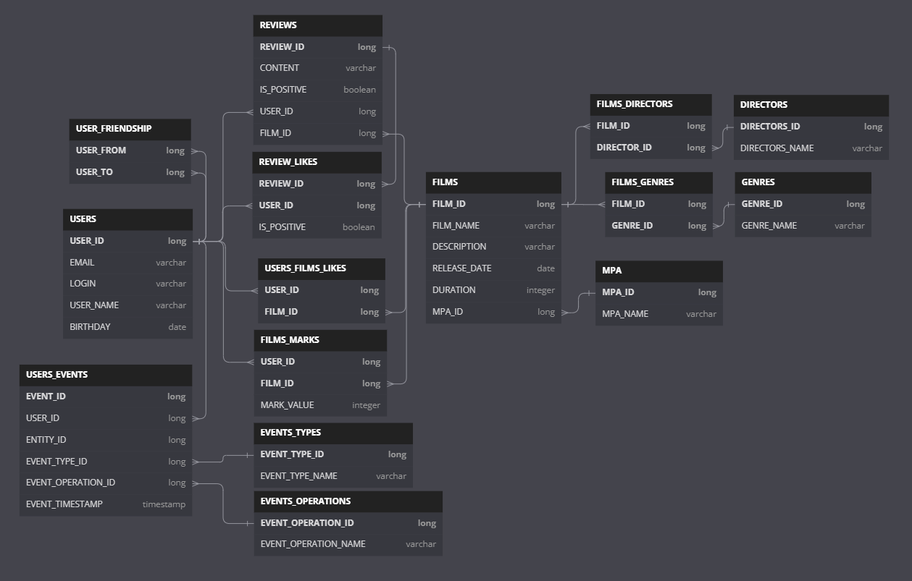

## Структура БД

---

## Описание БД

---

### USERS
Пользователи 
<b>USER_ID</b> - ключевое поле, автоинкремент 
<b>EMAIL, LOGIN, USER_NAME, BIRTHDAY</b> - данные о пользователе

---

### USERS_FRIENDSHIP
Вспомогательная таблица для хранения данных о друзьях пользователей 
<b>(USER_FROM, USER_TO)</b> - составной ключ 
<b>USER_FROM</b> - от кого направлен запрос на дружбу 
<b>USER_TO</b> - кому направлен запрос на дружбу

---

### FILMS
Фильмы 
<b>FILM_ID</b> - ключевое поле, автоинкремент 
<b>FILM_NAME, DESCRIPTION, RELEASE_DATE, DURATION</b> - данные о фильме 
<b>MPA_ID</b> - ссылка на MPA фильма

---

### FILMS_GENRES
Вспомогательная таблица для взаимосвязи фильмов с их жанрами 
<b>(FILM_ID, GENRE_ID)</b> - составной ключ.

---

### GENRES
Все возможные жанры фильмов 
<b>GENRE_ID</b> - ключевое поле, автоинкремент 
<b>GENRE_NAME</b> - название жанра

---

### MPA
Все возможные MPA фильмов 
<b>MPA_ID</b> - ключевое поле, автоинкремент 
<b>MPA_NAME</b> - Обозначение MPA

---

### USERS_FILMS_LIKES
Вспомогательная таблица лайков фильмам от пользователей 
<b>(USER_ID, FILM_ID)</b> - составной ключ